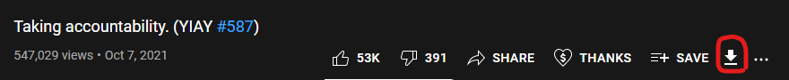

## Youtube Inline Downloader (YTILDL)
This is a userscript that allows you to download youtube videos by simply clicking a button on the YouTube video. This works in both light mode and dark mode, and downloads at around ~3-7mbps, depending on the current server load and your internet connection.

### How to download

- Install the **Tampermonkey** extension on Google Chrome, Mozilla Firefox, Safari (MacOS), Microsoft Edge (only the new version), or Opera. Other browsers that support userscripts should work, but Tampermonkey is just my recommended userscript manager.
  - [Install for Google Chrome](https://chrome.google.com/webstore/detail/tampermonkey/dhdgffkkebhmkfjojejmpbldmpobfkfo)
  - [Install for Mozilla Firefox](https://addons.mozilla.org/en-US/firefox/addon/tampermonkey/)
  - [Install for Safari (MacOS)](https://apps.apple.com/app/apple-store/id1482490089?mt=8) (This one is unfortunately not a free app, so I would not recommend it and would just go with a different web browser.)
  - [Install for Microsoft Edge (new version)](https://microsoftedge.microsoft.com/addons/detail/iikmkjmpaadaobahmlepeloendndfphd)
  - [Install for Opera](https://addons.opera.com/en/extensions/details/tampermonkey-beta/)
  - Tampermonkey also supports [Dolphin](https://play.google.com/store/apps/details?id=net.tampermonkey.dolphin) and [UC Browser](https://play.google.com/store/apps/details?id=net.tampermonkey.uc), although these have not been tested to work with this. 

- [Click here to install the userscript.](https://gist.github.com/Mastriel/e4896517fcfc1befd9a12e8cc6d5e8f6/raw/43955a07faf57391eafded41a95d624241d15ddc/ytildl.user.js)
  - If Tampermonkey is installed, you should get a screen prompting you to install the script. Press install to download the script.
- The script should be installed, and you can just reload your YouTube video to see the new button. Make sure to look at the known bugs/problems below before reporting a bug to me.
  
## Known Bugs/Problems

- Downloads take around 5-20 seconds to start, depending on the size of the video.
- If you navigate directly to https://youtube.com/ from your browser, then click on a video, the download button will not appear. This is because youtube doesn't actually reload its page when it navigates to different videos. Reloading the page while on a video should fix this issue for now, and make it so all other videos you view in that tab have the download button.
- You can't see how large a video is while it is downloading, you can only see how much you have downloaded so far. This is due to the video being streamed directly from another program. Calculating how big the video is would take too much time to do, and slow down downloads drastically.

- You can't seek in the default windows video player, meaning you can't jump around in the video. This is because the video file that is downloaded uses a codec that windows' default video player can't properly read. Applications such as [VLC](https://www.videolan.org/) are able to use this video format properly though, and allow for seeking.
- The following videos cannot be downloaded. This isn't a problem with the userscript, it's a problem with YouTube's API, which requires you to have special authentication to download these:
  - Region restricted videos for the region you're in.
  - Private videos.
  - Rental videos.
  - YouTube Premium exclusive videos.
  - Some livestreams.
  - Please note that you will not get an error message for downloading any of these, it just flat out will not work.

## Report a bug
- If a download doesn't start within 1 minute, or something else isn't working as expected, contact me on Discord (Mastriel#0085), and I'll try and diagnose the bug. Don't try to spam the download button, please.